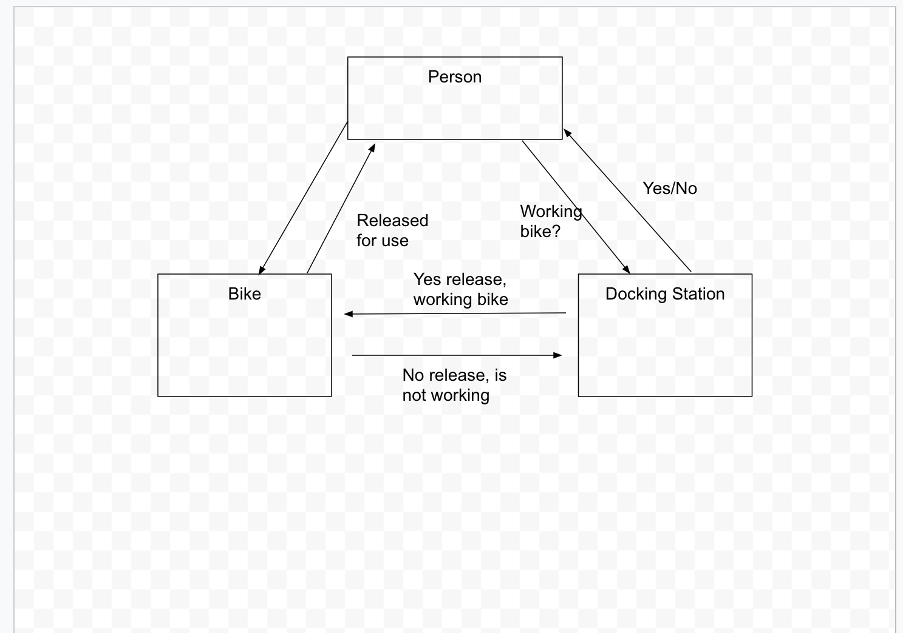

## Functional Representation ##

* Functional Representation

  <table>
    <thead>
      <tr>
        <th>object</th>
        <th>messages</th>
      </tr>
    </thead>
    <tbody>
        <tr>
            <td>"Person"</td>
            <td>"use"</td>
        </tr>
        <tr>
            <td>"Docking Station"</td>
            <td>"release"</td>
        </tr>
        <tr>
            <td>"Bike"</td>
            <td>"working" </td>
        </tr>
    </tbody>
  </table>
## Diagram Objects & Messages communication ##

